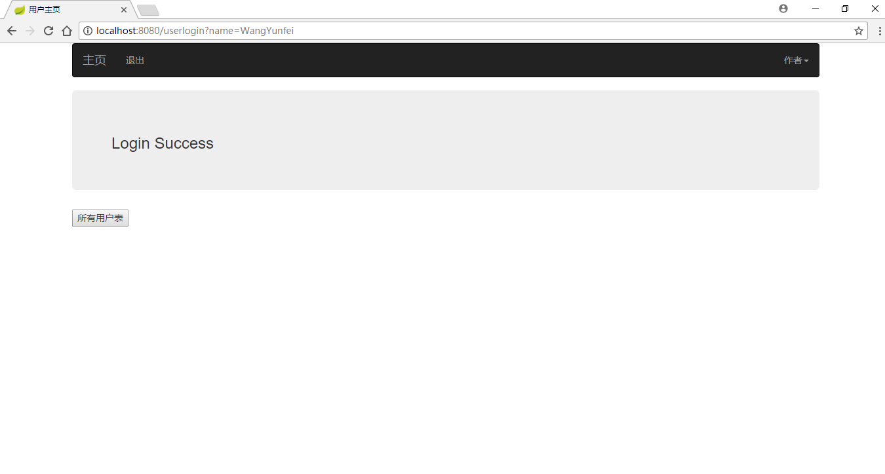
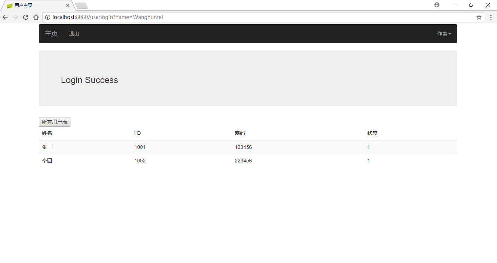
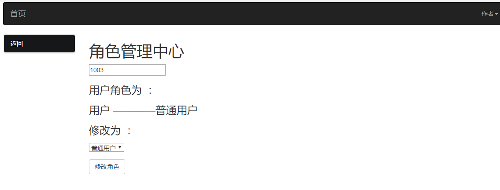

# spring boot web app 用户权限管理系统

该demo较为简单，适合初学者参考学习

参考链接： [spring boot guide](https://spring.io/guides/gs/serving-web-content/)

************
这是一个使用 spring boot 创建web application(只是个demo，并不完善，适用于学习框架),使用了如下框架

- spring boot

- spring mvc

- mybatis

- thymeleaf

- lommbok

************
使用方式

1. 下载该demo，git clone https://github.com/vvyun/springboot.git

2. 用idea / eclipse 打开项目

3. 使用mysql数据库新建系统数据库（sql文件见 [doc/180213170926.sql](doc/180213170926.sql)，数据库名、数据库用户名、密码自行在application.yml文件内修改）

4. 修改maven路径（本地路径，修改conf/settings.xml文件镜像用国内的）

5. 等待maven下载相关依赖

6. 运行MainApplication

7. 运行成功后访问 [http://localhost:8080/](http://localhost:8080/)  

************
运行截图：

